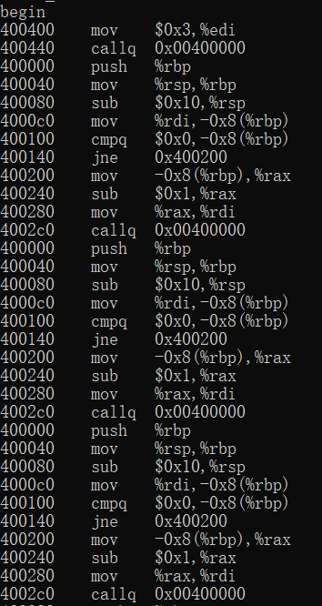

# 深入理解计算机系统（2）

汇编模拟器实现：解析递归函数`sum(3)`

递归函数：`recursive call`

```c
#include <stdint.h>
uint64_t sum(uint64_t n)
{
    if (n == 0)
    {
        return 0;
    }
    else
    {
        return n + sum(n - 1);
    }    
}

int main()
{
    uint64_t a = sum(3);
    return 0;
}

```

对应的汇编模拟器输出：



## 第一次代码重构

### 可变参数输出print函数

功能：通过一些bitmap来设置打印哪些模块，如stack、register或者linker等，打印它们的值。这样做的好处是，不同的模块调用相同的`printf`函数，提高代码复用，方便debug。

```c
// ./src/common/print.c

#include<stdarg.h>   	// 主要用于可变参数函数
#include<stdio.h>
#include<assert.h>
#include<headers/common.h>

// wrapper of stdio printf  // wrapper封装的意思
// controlled by the debug verbose bit set
// open_set： 指明哪些模块需要调用printf函数
uint64_t debug_printf(uint64_t open_set, const char *format, ...)  // 可变参数函数
{
    if ((open_set & DEBUG_VERBOSE_SET) == 0x0)
    {
        return 0x1;
    }

    // implementation of std printf()
    va_list argptr;
    va_start(argptr, format);  // 初始化argptr变量
    vfprintf(stderr, format, argptr);  // 输出到stderr中
    va_end(argptr);		// 允许使用了va_start的可变参数函数返回,这里是vfprintf函数

    return 0x0;
}
```

`stdarg.h`标准库

>
>
>**`stdarg.h`**是[C语言](https://zh.wikipedia.org/wiki/C語言)中[C标准库](https://zh.wikipedia.org/wiki/C標準函式庫)的[头文件](https://zh.wikipedia.org/wiki/標頭檔)，`stdarg`是由**st**andar**d**（标准） **arg**uments（参数）简化而来，主要目的为让函数能够接收不定量参数。
>
>[不定参数函数](https://zh.wikipedia.org/wiki/不定參數函式)（`Variadic functions`）是`stdarg.h`内容典型的应用，虽然也可以使用在其他由不定参数函数调用的函数（例如，`vprintf`）。

来源：[stdarg.h](https://zh.wikipedia.org/wiki/Stdarg.h)

变量类型

```c
va_list：这是一个适用于 va_start()、va_arg() 和 va_end() 这三个宏存储信息的类型。
```

库宏

```c
void va_start(va_list ap, last_arg)
// 这个宏初始化 ap 变量，它与 va_arg 和 va_end 宏是一起使用的。last_arg 是最后一个传递给函数的已知的固定参数，即省略号之前的参数。

type va_arg(va_list ap, type)
// 这个宏检索函数参数列表中类型为 type 的下一个参数。

void va_end(va_list ap)
// 这个宏允许使用了 va_start 宏的带有可变参数的函数返回。如果在从函数返回之前没有调用 va_end，则结果为未定义。    
```

另外关于`vfprintf`函数：根据参数列表将格式化输出写入到s中。

```c
/* Write formatted output to S from argument list ARG.

   This function is a possible cancellation point and therefore not
   marked with __THROW.  */
extern int vfprintf (FILE *__restrict __s, const char *__restrict __format,
		     __gnuc_va_list __arg);
```


补充：bitmap是bit manipulation的简写，是通过bit来控制一些流程。

### bitmap学习

通过一些宏定义，来调用同一封装函数print（可变参数函数），提高代码复用。

通过一个`DEBUG_VERBOSE_SET`(废话程度)宏，来控制对哪个模块的debug输出。

```c
// 通过或运算(|)来打开不同的模块：
// 这里是打开DEBUG_INSTRUCTIONCYCLE,DEBUG_REGISTERS和DEBUG_LINKER的debug开关
#define DEBUG_VERBOSE_SET           0X1 | 0x2 | 0x40
```

具体debug宏定义如下：

```c
#ifndef DEBUG_GUARD
#define DEBUG_GUARD

#include <stdint.h>

#define DEBUG_INSTRUCTIONCYCLE      0x1		// 指令周期debug开关
#define DEBUG_REGISTERS             0x2		// 寄存器dubug开关		
#define DEBUG_PRINTSTACK            0x4		// 栈debug开关
#define DEBUG_PRINTCACHESET         0x8
#define DEBUG_CACHEDETAILS          0x10
#define DEBUG_MMU                   0x20
#define DEBUG_LINKER                0x40
#define DEBUG_LOADER                0x80
#define DEBUG_PARSEINST             0x100

// vorbose set 是废话程度，通过一个宏来控制哪些模块的打印输出
#define DEBUG_VERBOSE_SET           0X1  

// do page walk
#define DEBUG_ENABLE_PAGE_WALK      0

// user sram cache for memory access
#define DEBUG_ENABLE_SRAM_CACHE     0

// print wrapper print的封装
// open_set 填写需要debug的宏
uint64_t dubug_printf(uint64_t open_set, const char *format, ...);

#endif
```

### P10 有限自动机


解析字符串的状态机分析图：


小括号：parenthesis


### P11

更新cpu的标志位定义

使用结构体来定义`CPU_FLAGS_STRUCT`。其中，使用union结构共享内存：让`__cpu_flag_values`(64 bit)和四个标志位共享内存（16 bit exlusively）。这样初始化4个标志位的时候，直接`__cpu_flag_values =0`即可。代替`CF = 0, ZF = 0, SF = 0, OF = 0`。

```c
typedef struct CPU_FLAGS_STRUCT
{
    union
    {
        uint64_t __cpu_flag_values;
        struct 
        {
            // carry flag: detect overflow for unsigned operations
            uint16_t CF;
            // zero flag: result is zero
            uint16_t ZF;
            // sign flag: result is negative: highest bit
            uint16_t SF;
            // overflow flag: detect overflow for signed operations
            uint16_t OF;
        }; 
    };   
} cpu_flag_t;
```

指令解析完成，使用字符串的形式把(P1~P9)的工作又做了一遍。

#### 递归求和函数c语言和汇编语言

递归求和的c语言代码

```c
#include <stdint.h>
uint64_t sum(uint64_t n)
{
    if (n == 0)
    {
        return 0;
    }
    else
    {
        return n + sum(n - 1);
    }    
}

int main()
{
    uint64_t a = sum(3);
    return 0;
}

```

对应的汇编指令

```c
char assembly[19][MAX_INSTRUCTION_CHAR] = {
        "push   %rbp",              // 0
        "mov    %rsp,%rbp",         // 1
        "sub    $0x10,%rsp",        // 2
        "mov    %rdi,-0x8(%rbp)",   // 3
        "cmpq   $0x0,-0x8(%rbp)",   // 4
        "jne    0x400200",          // 5: jump to 8
        "mov    $0x0,%eax",         // 6
        "jmp    0x400380",          // 7: jump to 14
        "mov    -0x8(%rbp),%rax",   // 8
        "sub    $0x1,%rax",         // 9
        "mov    %rax,%rdi",         // 10
        "callq  0x00400000",        // 11
        "mov    -0x8(%rbp),%rdx",   // 12
        "add    %rdx,%rax",         // 13
        "leaveq ",                  // 14
        "retq   ",                  // 15
        "mov    $0x3,%edi",         // 16：starting point
        "callq  0x00400000",        // 17:jump to 0 调用sum函数
        "mov    %rax,-0x8(%rbp)",   // 18: last execute
    };

```


c语言断言`assert`的使用

> ASSERT() 是一个调试程序时经常使用的宏，在程序运行时它计算括号内的表达式，如果表达式为 FALSE (0), 程序将报告错误，并终止执行。如果表达式不为 0，则继续执行后面的语句。这个宏通常原来判断程序中是否出现了明显非法的数据，如果出现了终止程序以免导致严重后果，同时也便于查找错误。
>
> **ASSERT 只有在 Debug 版本中才有效，如果编译为 Release 版本则被忽略**
>
> 来源：菜鸟教程


现在开始条件码（`conditon codes`）部分的代码

#### 回调函数的实现

##### call和ret指令的实现

原理：主要是rip寄存器和rsp寄存器的改变。


`call`指令

第一步：`rsp`指向下一个空的格，即向下减8。

```c
(cr->reg).rsp = (cr->reg).rsp - 8;
```

第二步：下一条指令地址存入新的`rsp`中。

```c
 write64bits_dram(   // 下一条指令写入rsp中
        va2pa((cr->reg).rsp, cr),
        cr->rip + sizeof(char) * MAX_INSTRUCTION_CHAR,
        cr
        );
```

第三步：`rip`指向被调函数的地址。

```c
 // jump to target function address
    cr->rip = src;   
```

第四步：`call`指令会使得标志位清零。

`call`指令的回调函数代码如下：

```c
static void call_handler(od_t *src_od, od_t *dst_od, core_t *cr)
{
    uint64_t src = decode_operand(src_od);
    // uint64_t dst = decode_operand(dst_od);

    // src: immediate number: virtual address of target function starting
    // dst: empty
    // push the return value
    (cr->reg).rsp = (cr->reg).rsp - 8;
    write64bits_dram(   // 下一条指令写入rsp中
        va2pa((cr->reg).rsp, cr),
        cr->rip + sizeof(char) * MAX_INSTRUCTION_CHAR,
        cr
        );
    // jump to target function address
    cr->rip = src;   
    reset_cflags(cr);
}
```

`ret`指令

第一步：取出`rsp`中的返回地址。

```c
uint64_t ret_addr = read64bits_dram(  // 取出rsp中的返回地址
        va2pa((cr->reg).rsp, cr),
        cr
        );
```

第二步：`rsp`向上恢复一格，即加8。

```c
    (cr->reg).rsp = (cr->reg).rsp + 8;

```

第三步：`rip`指向返回地址。

```c
// jump to return address
    cr->rip = ret_addr;
```

`ret`指令的回调函数代码如下：

```c
static void ret_handler(od_t *src_od, od_t *dst_od, core_t *cr)
{
    // uint64_t src = decode_operand(src_od);
    // uint64_t dst = decode_operand(dst_od);

    // src: empty
    // dst: empty
    // pop rsp
    uint64_t ret_addr = read64bits_dram(  // 取出rsp中的返回地址
        va2pa((cr->reg).rsp, cr),
        cr
        );
    (cr->reg).rsp = (cr->reg).rsp + 8;
    // jump to return address
    cr->rip = ret_addr;
    reset_cflags(cr);
}
```


##### add函数设置标志位

加法有符号溢出的判断：`!(src_sign ^ dst_sign)&&(src_sign ^ val_sign)`：根据`src + dst = val` 三个数的标志位来确定有符号数溢出。

```c

static void add_handler(od_t *src_od, od_t *dst_od, core_t *cr)
{
    uint64_t src = decode_operand(src_od);
    uint64_t dst = decode_operand(dst_od);

    if (src_od->type == REG && dst_od->type == REG)
    {
        // src: register (value: int64_t bit map)
        // dst: register (value: int64_t bit map)
        uint64_t val = *(uint64_t *)dst + *(uint64_t *)src;
        int val_sign = ((val >> 63) & 0x1);
        int src_sign = ((src >> 63) & 0x1);
        int dst_sign = ((dst >> 63) & 0x1);

        // set condition flags
        cr->flags.CF = (val < *((uint64_t *)src)); // unsigned
        cr->flags.SF = ((val >> 63) & 0x1);
        cr->flags.OF = (src_sign == 0 && dst_sign == 0 && val_sign == 1) || 
                        (src_sign == 1 && dst_sign == 1 && val_sign == 0); // signed
        cr->flags.ZF = (val == 0);

        // update registers
        *(uint64_t *)dst = val;
        // signed and unsigned value follow the same addition. e.g.
        // 5 = 0000000000000101, 3 = 0000000000000011, -3 = 1111111111111101, 5 + (-3) = 0000000000000010
        next_rip(cr);
        return;
    }
}

```

##### sub函数设置标志位

```c
static void sub_handler(od_t *src_od, od_t *dst_od, core_t *cr)
{
    uint64_t src = decode_operand(src_od);
    uint64_t dst = decode_operand(dst_od);

    if (src_od->type == IMM && dst_od->type == REG)
    {
        // src: register (value: int64_t bit map)
        // dst: register (value: int64_t bit map)
        // dst = dst - src = dst + (-src)
        uint64_t neg_src = ~src + 1;
        uint64_t val = *(uint64_t *)dst + neg_src;

        int val_sign = ((val >> 63) & 0x1);
        int src_sign = ((src >> 63) & 0x1);
        int dst_sign = ((dst >> 63) & 0x1);

        // set condition flags
        cr->flags.CF = (val > *(uint64_t *)dst); // unsigned
        cr->flags.SF = val_sign;
        cr->flags.OF = (dst_sign == 0 && src_sign == 1 && val_sign == 1) ||
                        (dst_sign == 1 && src_sign == 0 && val_sign == 0); // signed
        cr->flags.ZF = (val == 0);
        // update registers
        *(uint64_t *)dst = val;
        next_rip(cr);
        return;
    }
}
```


##### cmp函数设置标志位


根据下图：我们发现，cmp指令的实现逻辑就是sub(S2-S1)，可以借鉴sub指令实现过程。


```c
static void cmp_handler(od_t *src_od, od_t *dst_od, core_t *cr)
{
    uint64_t src = decode_operand(src_od);
    uint64_t dst = decode_operand(dst_od);  // 虚拟地址

    if (src_od->type == IMM && dst_od->type >= MEM_IMM)  // cmpq imm，memory
    {
        // src: register (value: int64_t bit map)
        // dst: register (value: int64_t bit map)
        // dst = dst - src = dst + (-src)
        uint64_t neg_src = ~src + 1;
        uint64_t dst_val = read64bits_dram(va2pa(dst, cr), cr);
        uint64_t val = dst_val + neg_src;

        int val_sign = ((val >> 63) & 0x1);
        int src_sign = ((src >> 63) & 0x1);
        int dst_sign = ((dst_val >> 63) & 0x1);

        // set condition flags
        cr->flags.CF = (val > dst_val); // unsigned
        cr->flags.SF = val_sign;
        cr->flags.OF = (dst_sign == 0 && src_sign == 1 && val_sign == 1) ||
                        (dst_sign == 1 && src_sign == 0 && val_sign == 0); // signed
        cr->flags.ZF = (val == 0);

        // signed and unsigned value follow the same addition. e.g.
        // 5 = 0000000000000101, 3 = 0000000000000011, -3 = 1111111111111101, 5 + (-3) = 0000000000000010
        next_rip(cr);
        return;
    }
}
```


##### jne指令


该命令`"jne    0x400200"`后面跟的是立即数，

`jne`是根据上一条指令也就是`cmp`后面，其中`cmp`指令相当于`sub`指令，会设置各种标志位，`jne`会使用`cmp`设置的`ZF`标志位。

如果`ZF == 0`，说明`cmp src, dst` 这条指令中`dst`和`src`并不相等，此时`jne`会跳转。因为，如果`cmp src, dst` 计算出来`dst`和`src`相等的话，会置 `ZF == 1`。

```c
// jne: jump when not equal(zero)
static void jne_handler(od_t *src_od, od_t *dst_od, core_t *cr)
{
    uint64_t src = decode_operand(src_od);
    // src_od is actually an instruction memory address
    // but we are interpreting it as an immediate number
    if (cr->flags.ZF == 0)
    {
        // last instruction value != 0
        cr->rip = src;
    }
    else
    {
        // last instruction value == 0
        next_rip(cr);
    }
    cr->flags.__cpu_flag_values = 0; // 标志位重置
}
```


##### jmp指令实现


无条件跳转到`src`

```c
static void jmp_handler(od_t *src_od, od_t *dst_od, core_t *cr)
{
    uint64_t src = decode_operand(src_od);
    cr->rip = src;
    cr->flags.__cpu_flag_values = 0;
}
```

##### leave指令实现逻辑


```c
leave
movq %rbp, %rsp
popq %rbp
```


```c
static void leave_handler(od_t *src_od, od_t *dst_od, core_t *cr)
{
    // mov %rbp, %rsp
    (cr->reg).rsp = (cr->reg).rbp;
    // popq %rbp
    // rbp 恢复到调用前的rbp，即恢复到上一个栈帧
    uint64_t old_val = read64bits_dram(
            va2pa((cr->reg).rsp, cr),
            cr
            );
    (cr->reg).rsp = (cr->reg).rsp + 8;
    (cr->reg).rbp = old_val;
    next_rip(cr);
    reset_cflags(cr);
    return;
}
```

#### add函数的汇编模拟器

add函数的测试函数：

```c
static void TestAddFunctionCallAndComputation()
{
    ACTIVE_CORE = 0x0;
    
    core_t *ac = (core_t *)&cores[ACTIVE_CORE];
	// ... 省略
    char assembly[15][MAX_INSTRUCTION_CHAR] = {  // 调用add函数的汇编过程
        "push   %rbp",              // 0
        "mov    %rsp,%rbp",         // 1
        "mov    %rdi,-0x18(%rbp)",  // 2
        "mov    %rsi,-0x20(%rbp)",  // 3
        "mov    -0x18(%rbp),%rdx",  // 4
        "mov    -0x20(%rbp),%rax",  // 5
        "add    %rdx,%rax",         // 6
        "mov    %rax,-0x8(%rbp)",   // 7
        "mov    -0x8(%rbp),%rax",   // 8
        "pop    %rbp",              // 9
        "retq",                     // 10
        "mov    %rdx,%rsi",         // 11
        "mov    %rax,%rdi",         // 12
        "callq  0x00400000",        // 13
        "mov    %rax,-0x8(%rbp)",   // 14
    };

    // copy to physical memory
    for (int i = 0; i < 15; ++ i)
    {
        writeinst_dram(va2pa(i * 0x40 + 0x00400000, ac), assembly[i], ac);
        // 0x40 是一条指令的大小
    }
    ac->rip = MAX_INSTRUCTION_CHAR * sizeof(char) * 11 + 0x00400000;
    
    printf("begin\n");
    int time = 0;
    while (time < 15)
    {
        instruction_cycle(ac);
        print_register(ac);
        print_stack(ac);
        time ++;
    } 
    // 省略...
}

```

测试结果

```bash
begin
4002c0    mov    %rdx,%rsi
400300    mov    %rax,%rdi
400340    callq  0x00400000
400000    push   %rbp
400040    mov    %rsp,%rbp
400080    mov    %rdi,-0x18(%rbp)
4000c0    mov    %rsi,-0x20(%rbp)
400100    mov    -0x18(%rbp),%rdx
400140    mov    -0x20(%rbp),%rax
400180    add    %rdx,%rax
4001c0    mov    %rax,-0x8(%rbp)
400200    mov    -0x8(%rbp),%rax
400240    pop    %rbp
400280    retq
400380    mov    %rax,-0x8(%rbp)
register match
memory match
```


#### 递归调用的汇编模拟器

调用递归函数`sum(3)`的测试函数：

```c
static void TestSumRecursiveCondition()
{
    ACTIVE_CORE = 0x0;
    core_t *cr = (core_t *)&cores[ACTIVE_CORE];

    char assembly[19][MAX_INSTRUCTION_CHAR] = {  // 调用sum函数的汇编主要过程
        "push   %rbp",              // 0
        "mov    %rsp,%rbp",         // 1
        "sub    $0x10,%rsp",        // 2
        "mov    %rdi,-0x8(%rbp)",   // 3
        "cmpq   $0x0,-0x8(%rbp)",   // 4
        "jne    0x400200",          // 5: jump to 8
        "mov    $0x0,%eax",         // 6
        "jmp    0x400380",          // 7: jump to 14
        "mov    -0x8(%rbp),%rax",   // 8
        "sub    $0x1,%rax",         // 9
        "mov    %rax,%rdi",         // 10
        "callq  0x00400000",        // 11
        "mov    -0x8(%rbp),%rdx",   // 12
        "add    %rdx,%rax",         // 13
        "leaveq ",                  // 14
        "retq   ",                  // 15
        "mov    $0x3,%edi",         // 16：starting point
        "callq  0x00400000",        // 17:jump to 0
        "mov    %rax,-0x8(%rbp)",   // 18: last execute
    };

    // copy to physical memory
    for (int i = 0; i < 19; ++ i)
    {
        writeinst_dram(va2pa(i * 0x40 + 0x00400000, cr), assembly[i], cr);
        // 0x40 是一条指令的大小
    }
    cr->rip = MAX_INSTRUCTION_CHAR * sizeof(char) * 16 + 0x00400000;

    printf("begin\n");
    int time = 0;
    while ((cr->rip <= 18 * 0x40 + 0x00400000) &&
           time < MAX_NUM_INSTRUCTION_CYCLE)
    {
        instruction_cycle(cr);
        print_register(cr);
        print_stack(cr);
        time ++;
    } 
}
```

调用递归函数`sum(3)`测试结果：汇编递归的过程

```bash
azheng@lishizheng:/mnt/e/csapp_bilibili/ass_first_refactory$ make hardware
begin
400400    mov    $0x3,%edi
400440    callq  0x00400000      // 调用sum(3)
400000    push   %rbp
400040    mov    %rsp,%rbp
400080    sub    $0x10,%rsp
4000c0    mov    %rdi,-0x8(%rbp)   // sum(n) n存在寄存器%rdi中，这里n = 3
400100    cmpq   $0x0,-0x8(%rbp) // 比较 n == 0 ？
400140    jne    0x400200		// 不等，跳转到0x400200 
400200    mov    -0x8(%rbp),%rax  //
400240    sub    $0x1,%rax  	// n = n - 1 = 3 - 1 = 2
400280    mov    %rax,%rdi 	    
4002c0    callq  0x00400000		// 调用sum(2)
400000    push   %rbp
400040    mov    %rsp,%rbp
400080    sub    $0x10,%rsp
4000c0    mov    %rdi,-0x8(%rbp)
400100    cmpq   $0x0,-0x8(%rbp) // 比较 n == 0 ?
400140    jne    0x400200		 // 不等，跳转到0x400200 
400200    mov    -0x8(%rbp),%rax
400240    sub    $0x1,%rax 		// n = n - 1 = 2 - 1 = 1
400280    mov    %rax,%rdi
4002c0    callq  0x00400000		// 调用sum(1)
400000    push   %rbp
400040    mov    %rsp,%rbp
400080    sub    $0x10,%rsp
4000c0    mov    %rdi,-0x8(%rbp)
400100    cmpq   $0x0,-0x8(%rbp)
400140    jne    0x400200
400200    mov    -0x8(%rbp),%rax
400240    sub    $0x1,%rax
400280    mov    %rax,%rdi
4002c0    callq  0x00400000		// 调用sum(0)
400000    push   %rbp
400040    mov    %rsp,%rbp
400080    sub    $0x10,%rsp
4000c0    mov    %rdi,-0x8(%rbp)
400100    cmpq   $0x0,-0x8(%rbp) // n == 0 ?	
400140    jne    0x400200		// 此时 n == 0，故jne不跳转
400180    mov    $0x0,%eax		// 继续执行cmp后面的指令
4001c0    jmp    0x400380		// 无条件跳转到指令leaveq
400380    leaveq				// 恢复%rbp
4003c0    retq					// sum(0)函数返回
400300    mov    -0x8(%rbp),%rdx
400340    add    %rdx,%rax
400380    leaveq
4003c0    retq					// sum(1)函数返回					
400300    mov    -0x8(%rbp),%rdx
400340    add    %rdx,%rax
400380    leaveq
4003c0    retq					// sum(2)函数返回
400300    mov    -0x8(%rbp),%rdx
400340    add    %rdx,%rax
400380    leaveq
4003c0    retq					// sum(3)函数返回
400480    mov    %rax,-0x8(%rbp)
register match
memory match
```

#### 指令周期

目前为止，我们模拟了下图中蓝色框内的部分：指令周期的流程，这里采用的是定长指令集格式，每条指令长度为`64 * sizeof(char)`（这里是用字符数组的）。


*图片来源：yaaangmin*

指令周期执行过程

第一步：取指。根据`rip`寄存器从内存中取出指令。

第二步：译码。解析指令字符串，通过线性扫描（不会退）解析出(操作码，源操作数，目的操作数)，即`(op, src, dst)`。保存在`inst_t`结构中。

其中，指令结构`inst_t`定义如下

```c
typedef struct INST_STRUCT
{
    op_t    op;         // enum of operators. e.g. mov, call, etc.
    od_t    src;        // operand src of instruction
    od_t    dst;        // operand dst of instruction
} inst_t;

```

第三步：执行指令。这步具体是如何工作的呢？根据指令类型op，去查函数指针表，找到合适的回调函数。这里会涉及访存，写寄存器，设置条件码等工作。

第四步：根据`rip`继续选择指令执行。下一条指令地址rip的设置可能来源于call,jmp/jne, next_rip等。

补充：代码段(`.text`)的起始地址是`0x00400000`

指令周期代码

```c
// instruction cycle is implemented in CPU
// the only exposed interface outside CPU
void instruction_cycle(core_t *cr)
{
    // FETCH: get the instruction string by program counter
   // const char *inst_str = (const char *)cr->rip;  // 虚拟地址解释为字符串指针
    char inst_str[MAX_INSTRUCTION_CHAR + 10];  // 数组大小 +10 是防止字符数组溢出
    readinst_dram(va2pa(cr->rip, cr), inst_str, cr); // 根据rip从内存取指，存入inst_str中
    debug_printf(DEBUG_INSTRUCTIONCYCLE, "%lx    %s\n", cr->rip, inst_str);

    // DECODE: decode the run-time instruction operands
    inst_t inst;
    parse_instruction(inst_str, &inst, cr); // 解析inst_str指向字符串，解析的值传给inst结构
    
    // EXECUTE: get the function pointer or handler by the operator
    handler_t handler = handler_table[inst.op];
    // update CPU and memory according the instruction
    handler(&(inst.src), &(inst.dst), cr);
}

```

