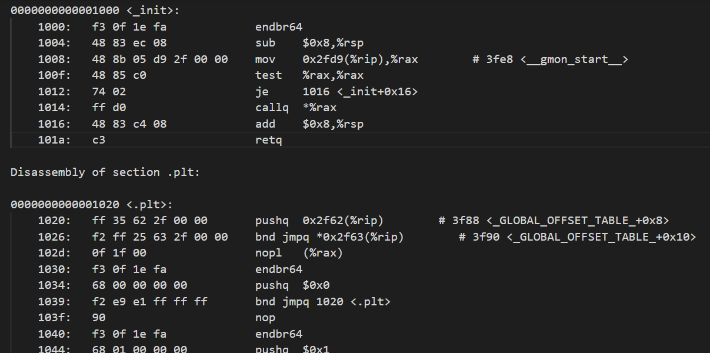
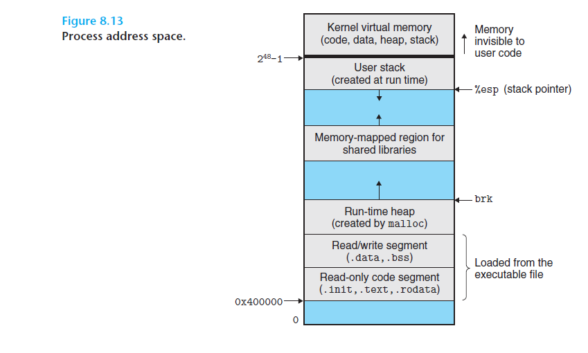
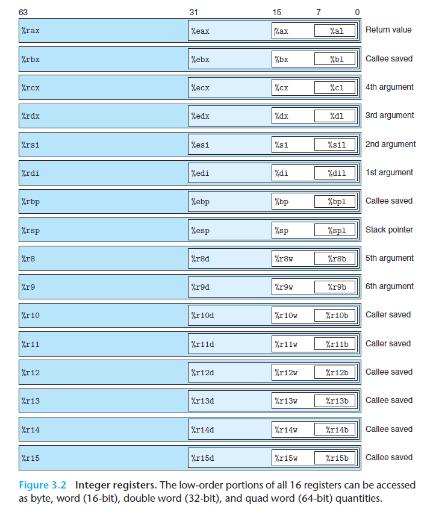
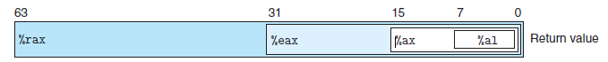
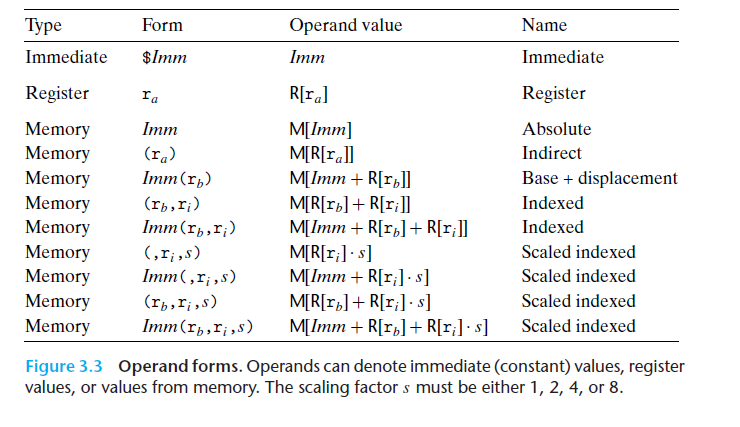
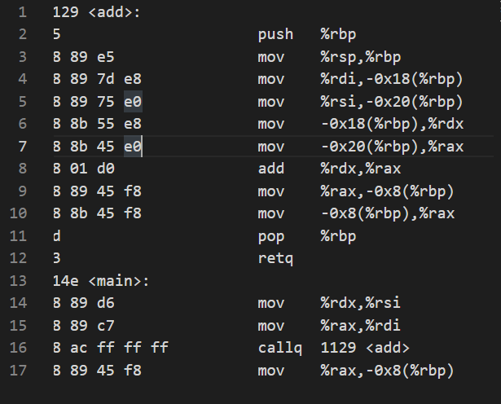
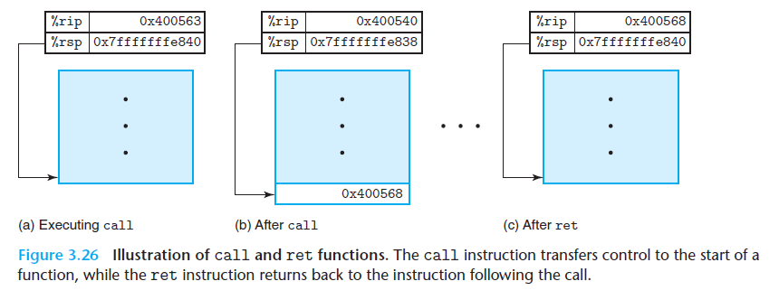
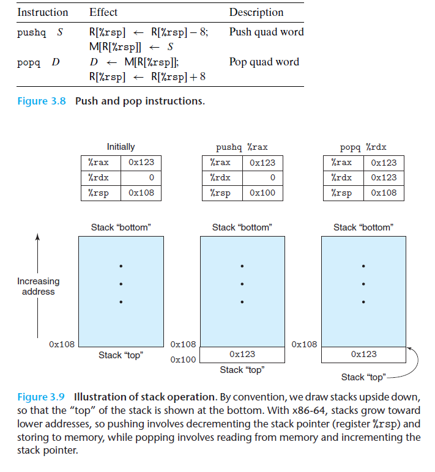
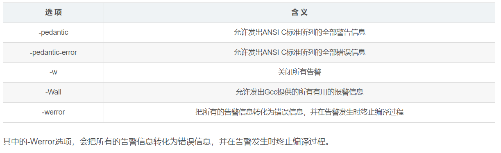

# 深入理解计算机系统笔记


## P1笔记

安装wsl 和在wsl中安装vscode

[`wsl2`安装`vscode`安装和配置记录]https://blog.csdn.net/shizheng_Li/article/details/122342583?spm=1001.2014.3001.5501


## p2笔记

命令行编译c文件格式：

```
gcc 文件名.c -o 自定义生成的文件名
```

命令行编译`cpp`文件格式： 

```
g++ 文件名.cpp  -o  生成的文件名
```

命令行运行`cpp`文件格式：

```
./文件名
```

具体操作如下：

```bash
azheng@lishizheng:/mnt/e/csapp_bilibili$ ls
a.out  main.cpp
azheng@lishizheng:/mnt/e/csapp_bilibili$ g++ main.cpp -o main
azheng@lishizheng:/mnt/e/csapp_bilibili$ ./main
1
Hello, world
azheng@lishizheng:/mnt/e/csapp_bilibili$
```

上面先编译后执行两句命令，可以合并为编译执行一起做

```
g++ main.cpp -o main && ./main
```


`lowbit`操作：二进制中取出最后位的1，主要用于树状数组(segment array)中

```cpp
unsigned LowBit(unsigned x) 
{
    unsigned a = x & (-x); 
    //等价写法 unsigned a = x & ((~x) + 1); 
    return a;
}
```

判断输入的十六进制数是不是字母(a~f)

对于二进制数:$a = x_3x_2x_1x_0$, 判断a是十六进制中字母`（a-f）`的逻辑表达式为: $x_3 \& (x_1 | x_2)$

```cpp
// 判断给定的十六进制数是否为a~f这些字母
//    return：每四位判断一下是否为字母，是的话为1，否则为0
//    input:0xab, output: 0x11
//    input 0xab123abcd, output: 0x110001111
unsigned Letter(unsigned x)
{
    // 每4位取出对应的x1，x2，x3
    // x3 x2 x1 x0 -hex
    // 0  0  1  0  - hex constant - 0x2
    // 0  0  x1 0  - result of &
    // 32 / 4 = 8, we need 8 2s  -0x22222222
    unsigned x1 = x & 0x22222222; // 取出每四位的倒数第二位x1
    unsigned x2 = x & 0x44444444; // 取出每四位的倒数第三位x2
    unsigned x3 = x & 0x88888888; // 取出每四位的最高位x3

    //判断是否为字母的逻辑表达式: x3 * (x1 + x2) <====> x3 & (x1 + x2)
    return (x3 >> 3) & ((x1 >> 1) | (x2 >> 2)); // a = 0, a = 1;
}
```

## p3笔记

浮点数（float）类型

符号位、阶码(E)和尾数(fraction)三部分，共计32位，分别是1 + 8 + 23位。

## p4笔记

根据可执行文件，生成汇编代码的指令（反汇编指令）

```
objdump -d 文件名
objdump -d main
```

可输出如下图所示的汇编代码

重定向到某个`txt`文件，需要使用如下代码

```
objdump -d main > main.txt 
功能：将main反汇编之后输出到main.txt文件
code main.txt 
功能：用vs code 打开main.txt
```



补充：`vscode`隐藏下面输出面板，快捷键是$ctrl + j$

进程的内存空间具体划分



从下往上依次是：程序数据(.`data`, `.bss`等),往上依次是堆(`malloc`)，共享库，用户栈(`user stack`)，最上面是内核地址空间


## 汇编模拟器(p5-9)

该汇编模拟器模拟对add函数所生成的节选代码进行打印输出。

```c
//add.c
#include <stdint.h>

uint64_t add(uint64_t a, uint64_t b)
{
    return a + b;
}

int main()
{
    uint64_t a = 0x12340000;
    uint64_t b = 0x0000abcd;
    uint64_t c = add(a, b);

    return 0;
}
```

定义`reg`结构

模仿下图的寄存器结构定义`reg`结构体。



`reg`寄存器举例



```c
  union // union联合体，共享低地址内存
    {
        struct 
        {
            uint8_t al;
            uint8_t ah;
        };
        uint16_t ax;
        uint32_t eax;
        uint64_t rax;   
    };
```

具体访存类型的实现，九种访存，两种其他（立即数，寄存器），通过函数

```c
static uint64_t decode_od(od_t od)
```



操作符，操作数，指令的结构体定义

```c
// 操作符的类型
typedef enum OP
{
    MOV,    // 0
    PUSH,   // 1
    CALL,    // 2
    add_reg_reg // 3
} op_t;

// 操作数的类型
typedef struct OD
{
    od_type_t type;
    int64_t imm;
    int64_t scal;
    uint64_t *reg1;
    uint64_t *reg2;
    char code[100];
} od_t;

// 指令的结构定义
typedef struct INSTRUCT_STRUCT
{
    op_t op;  // operator
    od_t src; // operand
    od_t dst; // operand
} inst_t;
```


操作码译码的代码实现

```c
/*
    operand decoding
    immediate/ register/ memory(9)
*/
static uint64_t decode_od(od_t od)
{
    if (od.type == IMM)
    {
        return *(uint64_t *)&od.imm; // &取地址，然后转换为uint64类型的指针，然后再取该地址的值(*)
    }
    else if (od.type == REG)
    {
        // address in register
        return (uint64_t)od.reg1; 
    }
    else
    {
        // mm
        uint64_t vaddr = 0;
        if (od.type == MM_IMM)
        {
            vaddr = od.imm;
        }
        else if (od.type == MM_REG)
        {
            // store reg
            vaddr = *(od.reg1);
        }
        else if (od.type == MM_IMM_REG)
        {
            vaddr = od.imm + *(od.reg1);
        }
        else if (od.type == MM_REG1_REG2)
        {
            vaddr = *(od.reg1) + *(od.reg2);
        }
        else if (od.type == MM_IMM_REG1_REG2)
        {
            vaddr = od.imm + *(od.reg1) + *(od.reg2);
        }
        else if (od.type == MM_RGE2_S)
        {
            vaddr = (*(od.reg2)) * od.scal;
        }
        else if (od.type == MM_IMM_REG2_S)
        {
            vaddr = (*(od.reg2)) * od.scal + od.imm;
        }
        else if (od.type == MM_REG1_REG2_S)
        {
            vaddr = *(od.reg1) + (*(od.reg2)) * od.scal;
        }
        else if (od.type == MM_IMM_REG1_REG2_S)
        {
            vaddr = *(od.reg1) + (*(od.reg2)) * od.scal + od.imm;
        }
        return va2pa(vaddr); // virtual address => physical address
    }
   
}
```


指令周期的实现

>while (1) {
>  从PC指示的存储器位置取出指令;
>  执行指令;
>  更新PC;
>}

代码

```c
// 指令周期
void instruction_cycle()
{
    // 取指令
    inst_t *instr = (inst_t *)reg.rip; // instruction address
    
    // 译码(取源操作数，目的操作数)
    uint64_t src = decode_od(instr->src);
    uint64_t dst = decode_od(instr->dst);

    // 根据指令的操作类型，查找函数指针数组，找到函数指针
    // forexample: add rax rbx 这里，op = add_reg_reg = 3
    handler_t handler = handler_table[instr->op];
    
    // 执行指令
    handler(src, dst);
}
```

指令从哪里来？来自PC，这里是`rip`寄存器

然后pc的值在哪里更新？在具体回调函数(handler)里面更新，比如几个`mov`指令的handler如下

```c
void mov_reg_reg_handler(uint64_t src, uint64_t dst)
{
    // src: reg
    // dst: reg
    *(uint64_t *)dst = *(uint64_t *)src;
    reg.rip = reg.rip + sizeof(inst_t); // 更新pc
}

void mov_reg_mem_handler(uint64_t src, uint64_t dst)
{
    // src: reg
    // dst: mem(vitual memory)
    write64bits_dram(
        va2pa(dst),
        *(uint64_t *)src
    ); // 寄存器本身的值写入内存（va2pa）
    reg.rip = reg.rip + sizeof(inst_t); // 更新pc
}

void mov_mem_reg_handler(uint64_t src, uint64_t dst)
{
    // src: mem(vitual memory)
    // dst: reg
    *(uint64_t *)dst = read64bits_dram(va2pa(src)); // 把内存中的值，赋值给dst指针指向的寄存器
    reg.rip = reg.rip + sizeof(inst_t); // 更新pc
}

```

简单的汇编模拟器模拟功能如下图：只能模拟下图的15条指令：

汇编指令格式完成15条，具体内容为模拟下图右侧15条汇编指令




结构定义如下

```c
inst_t program[INST_LEN] = 
{
    // uint64_t add(uint64_t, uint64_t)
    {
        push_reg,
        {   REG, 0, 0, (uint64_t *)&reg.rbp, NULL },
        {   EMPTY, 0, 0, NULL, NULL },
        "push   \%rbp"
    },
    {
        mov_reg_reg,
        {   REG, 0, 0, (uint64_t *)&reg.rsp, NULL },
        {   REG, 0, 0, (uint64_t *)&reg.rbp, NULL },
        "mov    \%rsp,\%rbp"
    },
    
	...
	
    // main entry point
    {
        mov_reg_reg,
        {   REG, 0, 0, (uint64_t *)&reg.rdx, NULL },
        {   REG, 0, 0, (uint64_t *)&reg.rsi, NULL },
        "mov    \%rdx,\%rsi"
    },
    {
        mov_reg_reg,
        {   REG, 0, 0, (uint64_t *)&reg.rax, NULL },
        {   REG, 0, 0, (uint64_t *)&reg.rdi, NULL },
        "mov    \%rax,\%rdi"
    },
    {
        call,
        {   IMM, (uint64_t)&(program[0]), 0, NULL, NULL},
        {   EMPTY, 0, 0, NULL, NULL},
        "callq  1129 <add>"  // call add函数的地址
    },
    {
        mov_reg_mem,
        {   REG, 0, 0, (uint64_t *)&reg.rax, NULL },
        {   MM_IMM_REG, -0x8, 0, (uint64_t *)&reg.rbp, NULL },
        "mov    \%rax,-0x8(\%rbp)" 
    }, 
}
```


完成15条汇编指令的定义之后，我们需要完成对具体指令的实现函数

使用gdb调试add函数

```shell
azheng@lishizheng:/mnt/e/csapp_bilibili/ass$ gdb add #使用gdb调试add函数(add.c编译完成的add文件)
Type "apropos word" to search for commands related to "word"...
Reading symbols from add...
(No debugging symbols found in add)
(gdb) b main  # main函数加断点
Breakpoint 1 at 0x114e
(gdb) run # 执行add函数
Starting program: /mnt/e/csapp_bilibili/ass/add

Breakpoint 1, 0x000055555555514e in main ()
(gdb) disas
Dump of assembler code for function main:
=> 0x000055555555514e <+0>:     endbr64  # 正在执行的代码在这一行
   0x0000555555555152 <+4>:     push   %rbp
   0x0000555555555153 <+5>:     mov    %rsp,%rbp
   0x0000555555555156 <+8>:     sub    $0x20,%rsp
   0x000055555555515a <+12>:    movq   $0x12340000,-0x18(%rbp)
   0x0000555555555162 <+20>:    movq   $0xabcd,-0x10(%rbp)
   0x000055555555516a <+28>:    mov    -0x10(%rbp),%rdx
   0x000055555555516e <+32>:    mov    -0x18(%rbp),%rax
   0x0000555555555172 <+36>:    mov    %rdx,%rsi
   0x0000555555555175 <+39>:    mov    %rax,%rdi
   0x0000555555555178 <+42>:    callq  0x555555555129 <add>
   0x000055555555517d <+47>:    mov    %rax,-0x8(%rbp)
   0x0000555555555181 <+51>:    mov    $0x0,%eax
   0x0000555555555186 <+56>:    leaveq
   0x0000555555555187 <+57>:    retq
End of assembler dump.
(gdb) ni 8 # 将执行的代码向下跳8行
0x0000555555555172 in main ()
(gdb) disas # 反汇编
Dump of assembler code for function main:
   0x000055555555514e <+0>:     endbr64
   0x0000555555555152 <+4>:     push   %rbp
   0x0000555555555153 <+5>:     mov    %rsp,%rbp
   0x0000555555555156 <+8>:     sub    $0x20,%rsp
   0x000055555555515a <+12>:    movq   $0x12340000,-0x18(%rbp)
   0x0000555555555162 <+20>:    movq   $0xabcd,-0x10(%rbp)
   0x000055555555516a <+28>:    mov    -0x10(%rbp),%rdx
   0x000055555555516e <+32>:    mov    -0x18(%rbp),%rax
=> 0x0000555555555172 <+36>:    mov    %rdx,%rsi  # 正在调试的代码在这一行
   0x0000555555555175 <+39>:    mov    %rax,%rdi
   0x0000555555555178 <+42>:    callq  0x555555555129 <add>
   0x000055555555517d <+47>:    mov    %rax,-0x8(%rbp)
   0x0000555555555181 <+51>:    mov    $0x0,%eax
   0x0000555555555186 <+56>:    leaveq
   0x0000555555555187 <+57>:    retq
End of assembler dump.
```

显示光标指向`mov %rdi, %rsi` 时add函数后的各个寄存器的值（状态机的一个状态）

```shell

(gdb) info r  # 寄存器的值
rax            0x12340000          305397760
rbx            0x555555555180      93824992235904
rcx            0x555555555180      93824992235904
rdx            0xabcd              43981
rsi            0x7fffffffe0e8      140737488347368
rdi            0x1                 1
rbp            0x7fffffffdff0      0x7fffffffdff0
rsp            0x7fffffffdfd0      0x7fffffffdfd0
r8             0x0                 0
r9             0x7ffff7fe0d50      140737354009936
r10            0x7                 7
r11            0x2                 2
r12            0x555555555040      93824992235584
r13            0x7fffffffe0e0      140737488347360
r14            0x0                 0
r15            0x0                 0
rip            0x55555555516a      0x55555555516a <main+36>
eflags         0x202               [ IF ]
cs             0x33                51
ss             0x2b                43
ds             0x0                 0
es             0x0                 0
fs             0x0                 0
gs             0x0                 0
(gdb)
```

（2022年1月10日14点25分更新）

gdb调试过程中的疑问解释

由于intel是小端机器，所以下面的机器代码（查看寄存器rsp附近的值）解释如下：

```
(gdb) x/10 0x7fffffffdfd0
0x7fffffffdfd0: 0x00000000      0x00000000      0x12340000      0x00000000
0x7fffffffdfe0: 0x0000abcd      0x00000000      0x00000000      0x00000000
0x7fffffffdff0: 0x00000000      0x00000000
(gdb)
```

首先，每一个`0x`开头的是32位二进制数，对于64位数值，两个`0x`组成一个数值，以$0x12340000 \quad    0x00000000$两个0x为例，解释小端机器。所谓小端机，就是低地址在前，高地址在后。即`0x12340000`是低位数，而`0x00000000`是高位数。所以这个数值为

```
0x0000000012340000 
而不是
0x1234000000000000(这是大端机：高地址在前，低地址在后)
```

两个寄存器rbp和rsp标志着该函数占用堆栈的起始地址和结束地址，由于堆栈是向下增长的，所以起始rbp要大于结束rsp

```
rbp            0x7fffffffdff0      0x7fffffffdff0
rsp            0x7fffffffdfd0      0x7fffffffdfd0
```

当执行完`mov    %rax,-0x8(%rbp)`之后各个寄存器的值（状态机的另一个状态）

```shell
(gdb) ni 4 # 向下执行4行
0x0000555555555179 in main ()
(gdb) disas 
Dump of assembler code for function main:
   0x0000555555555146 <+0>:     endbr64
   0x000055555555514a <+4>:     push   %rbp
   0x000055555555514b <+5>:     mov    %rsp,%rbp
   0x000055555555514e <+8>:     sub    $0x20,%rsp
   0x0000555555555152 <+12>:    movq   $0x12340000,-0x18(%rbp)
   0x000055555555515a <+20>:    movq   $0xabcd,-0x10(%rbp)
   0x0000555555555162 <+28>:    mov    -0x10(%rbp),%rdx
   0x0000555555555166 <+32>:    mov    -0x18(%rbp),%rax
   0x000055555555516a <+36>:    mov    %rdx,%rsi
   0x000055555555516d <+39>:    mov    %rax,%rdi
   0x0000555555555170 <+42>:    callq  0x555555555129 <add>
   0x0000555555555175 <+47>:    mov    %rax,-0x8(%rbp)
=> 0x0000555555555179 <+51>:    mov    $0x0,%eax
   0x000055555555517e <+56>:    leaveq
   0x000055555555517f <+57>:    retq
End of assembler dump.
(gdb) info r # 显示各个寄存器的值
rax            0x1234abcd          305441741
rbx            0x555555555180      93824992235904
rcx            0x555555555180      93824992235904
rdx            0x12340000          305397760
rsi            0xabcd              43981
rdi            0x12340000          305397760
rbp            0x7fffffffdff0      0x7fffffffdff0
rsp            0x7fffffffdfd0      0x7fffffffdfd0
r8             0x0                 0
r9             0x7ffff7fe0d50      140737354009936
r10            0x7                 7
r11            0x2                 2
r12            0x555555555040      93824992235584
r13            0x7fffffffe0e0      140737488347360
r14            0x0                 0
r15            0x0                 0
rip            0x555555555179      0x555555555179 <main+51>
eflags         0x202               [ IF ]
cs             0x33                51
ss             0x2b                43
ds             0x0                 0
es             0x0                 0
fs             0x0                 0
gs             0x0                 0
(gdb)
```

执行完add函数之后，校验内存（栈顶指针rsp附近的值）

```shell
(gdb) x/10 0x7fffffffdfd0
0x7fffffffdfd0: 0x00000000      0x00000000      0x12340000      0x00000000
0x7fffffffdfe0: 0x0000abcd      0x00000000      0x1234abcd      0x00000000
0x7fffffffdff0: 0x00000000      0x00000000
(gdb)

add运行前内存(栈顶指针rsp附近的值)
(gdb) x/10 0x7fffffffdfd0
0x7fffffffdfd0: 0x00000000      0x00000000      0x12340000      0x00000000
0x7fffffffdfe0: 0x0000abcd      0x00000000      0x00000000      0x00000000
0x7fffffffdff0: 0x00000000      0x00000000
```

#### 封装访存接口

使用指针访存是一件很危险的事情，所以需要把对内存的操作封装起来，形成定义好的、安全的接口，统一使用。

同时这里学习了flighting 的使用，即定义一个宏，来判断某项功能是否启用。这里定义宏`SRAM_CACHE_SETTING`来判断cache是否启用，为后续程序扩展带来了方便。

```c
// flighting标志
#define SRAM_CACHE_SETTING 0  // 是否使用cache

uint64_t read64bits_dram(uint64_t paddr)
{
    if (SRAM_CACHE_SETTING == 1)
    {
        return 0x0;
    }

    uint64_t val = 0x0;

    val += ((uint64_t)mm[paddr + 0]) << 0;
    val += ((uint64_t)mm[paddr + 1]) << 8;
    val += ((uint64_t)mm[paddr + 2]) << 16;
    val += ((uint64_t)mm[paddr + 3]) << 24;
    val += ((uint64_t)mm[paddr + 4]) << 32;
    val += ((uint64_t)mm[paddr + 5]) << 40;
    val += ((uint64_t)mm[paddr + 6]) << 48;
    val += ((uint64_t)mm[paddr + 7]) << 56;

    return val;
}

void write64bits_dram(uint64_t paddr, uint64_t data)
{
    if (SRAM_CACHE_SETTING == 1)
    {
        return;
    }
    // 将64bits的数据拆分，每8bits写入一个单元
    // mm[index] 是uint8_t类型
    mm[paddr + 0] = (data >> 0) & 0xff;  // mask 取8位
    mm[paddr + 1] = (data >> 8) & 0xff; 
    mm[paddr + 2] = (data >> 16) & 0xff; 
    mm[paddr + 3] = (data >> 24) & 0xff; 
    mm[paddr + 4] = (data >> 32) & 0xff; 
    mm[paddr + 5] = (data >> 40) & 0xff; 
    mm[paddr + 6] = (data >> 48) & 0xff; 
    mm[paddr + 7] = (data >> 56) & 0xff; 

}
```

#### 输出计算机状态

两个函数`print_register`和`print_stack`，用于输出寄存器和堆栈的值，辅助debug。

```c
// 输出寄存器状态
void print_register();
// 输出堆栈rsp上下各n(=10)个单元的状态
void print_stack();

void print_register()
{
    printf("rax = %16lx\trbx = %16lx\trcx = %16lx\trdx = %16lx\n",
        reg.rax, reg.rbx, reg.rcx, reg.rdx);
    printf("rsi = %16lx\trdi = %16lx\trbp = %16lx\trsp = %16lx\n",
        reg.rsi, reg.rdi, reg.rbp, reg.rsp);
    printf("rip = %16lx\n", reg.rip);
}

void print_stack()
{
    int n = 10;
    uint64_t *high = (uint64_t *)&mm[va2pa(reg.rsp)]; // 栈顶(物理地址)  
    high = &high[n];

    // 变量rsp_stack：虚拟地址indexing
    uint64_t rsp_start = reg.rsp + n * 8; // 栈底（高地址）：从rsp往上10条指令

    for (int i = 0; i < 2 * n; i ++) // 从高地址10，到低地址-10位
    {
        uint64_t *ptr = (uint64_t *)(high - i);
        printf("0x%016lx : %16lx", rsp_start, (uint64_t)*ptr);

        if (i == n)
        {
            printf(" <== rsp");
        }
        rsp_start = rsp_start - 8; // 每次8bytes更新stack的indexing

        printf("\n");
    }
}
```


### 实现指令

#### call和ret指令的实现

图示的解释：



上图a中`rip = 0x400563`的值时当前指令call的地址，图b中栈顶值`rip = 0x400568`这是 return address(执行完call调用的函数之后，从该地址继续执行)。从这两个rip的数值我们可以看出`x86`架构的call指令占`5B`(两个rip的值作差得到)。图b中`rip`的值为call的子函数的入口地址。

call指令的实现

主要是两个寄存器的值`rip`  和`rsp`，它们的功能如下：`rip`存有指令的地址，`rsp`为栈顶指针.

子程序调用（call）的具体步骤：

- call指令执行时，堆栈先要向下扩展一格：`rsp - 8byte`。

- 返回地址(return address)：`rsp`会更新为下一条指令的地址：`rsp = rip + sizeof(inst_t);`。
- rip更新为子程序的地址，等待被调用。

- 当call（调用子程序）完成后，会根据返回地址`rip`跳转到原程序的call指令的下一条指令继续执行。

代码实现

```c
// call指令的模拟实现
void call_handler(uint64_t src, uint64_t dst)
{
    // src: imm - address of called function
    // [1] 栈顶先下移一格
    reg.rsp = reg.rsp - 8; 
    // [2] write return address to rsp memory（返回地址写入栈顶rsp）
    write64bits_dram(
        va2pa(reg.rsp),
        reg.rip + sizeof(inst_t)  //return address: next instruction 
    );
    // [3] put address of callee to rip,waiting to execute(子程序的地址写入rip，等待执行)
    reg.rip = src;
}
// 将data写入物理内存paddr中
/* void write64bits_dram(uint64_t paddr, uint64_t data); */
```

ret指令的实现

```c
void ret_handler(uint64_t src, uint64_t dst)
{
    // 从rsp中取出返回地址
    uint64_t ret_addr = read64bits_dram(va2pa(reg.rsp));
    // 返回地址赋值给pc
    reg.rip = ret_addr;
    // rsp退格
    reg.rsp += 0x8;
}
```


#### push和pop指令的实现


push和pop原理




push的实现代码

```c
void push_handler(uint64_t src, uint64_t dst)
{
    // src: reg
    // dst: empty
    // rsp先减8
    reg.rsp = reg.rsp - 0x8;
    // write value pointed by src to rsp memory
    write64bits_dram(
        va2pa(reg.rsp),
        *(uint64_t *)src
    );
    // pc + 1
    reg.rip = reg.rip + sizeof(inst_t); // 更新pc
}
```

pop的实现代码

```c
void pop_handler(uint64_t src, uint64_t dst)
{
   // src: rbp
   // dst: empty
   // rsp指向的值写入到rbp中
   *(uint64_t *)src = read64bits_dram(va2pa(reg.rsp)); // va2pa是虚实地址转换
   // 栈顶指针回退一格
   reg.rsp = reg.rsp + 8;
   // pc + 1
   reg.rip = reg.rip + sizeof(inst_t);
}
```

至此，我们实现了模拟下图所示的15条汇编指令的汇编模拟器。


## bug 积累

### include重复包含的bug

```shell
In file included from ./src/disk/code.c:3:
./src/memory/instruction.h:33:5: note: previous definition of ‘MM_IMM_REG1_REG2_S’ was here
   33 |     MM_IMM_REG1_REG2_S
      |     ^~~~~~~~~~~~~~~~~~
In file included from ./src/disk/elf.h:4,
                 from ./src/disk/code.c:4:
./src/memory/instruction.h:37:16: error: redefinition of ‘struct OD’
   37 | typedef struct OD
      |                ^~
In file included from ./src/disk/code.c:3:
./src/memory/instruction.h:37:16: note: originally defined here
   37 | typedef struct OD
      |                ^~
In file included from ./src/disk/elf.h:4,
                 from ./src/disk/code.c:4:
./src/memory/instruction.h:44:3: error: conflicting types for ‘od_t’
   44 | } od_t;
```

解决办法是使用include guard，类似于设计模式里面的单例模式。

```c
//mmu.h
// include guard

#ifndef mmu_guard   // 如果宏mmm_guard 没有被定义，则往下执行，如果宏mmm_guard被定义了，则跳转到#endif

#define mmu_guard

// memory management unit
#include <stdint.h>

uint64_t va2pa(uint64_t vaddr);

#endif
```


### 未定义的类型转换int to uint8_t


```shell
azheng@lishizheng:/mnt/e/csapp_bilibili/ass$ make main
/usr/bin/gcc-9 -Wall -g -O2 -Werror -std=gnu99 -I./src ./src/memory/instruction.c ./src/cpu/mmu.c ./src/disk/code.c ./src/memory/dram.h ./src/main.c -o program
./src/main.c: In function ‘main’:
./src/main.c:28:33: error: unsigned conversion from ‘int’ to ‘uint8_t’ {aka ‘unsigned char’} changes value from ‘43981’ to ‘205’ [-Werror=overflow]
   28 |     mm[va2pa(0x7fffffffdfe0)] = 0x0000abcd;
      |                                 ^~~~~~~~~~
./src/main.c:29:33: error: unsigned conversion from ‘int’ to ‘uint8_t’ {aka ‘unsigned char’} changes value from ‘305397760’ to ‘0’ [-Werror=overflow]
   29 |     mm[va2pa(0x7fffffffdfd8)] = 0x12340000;
      |                                 ^~~~~~~~~~
cc1: all warnings being treated as errors
make: *** [makefile:12: main] Error 1
```

### uint64_t类型printf

```shell
azheng@lishizheng:/mnt/e/csapp_bilibili/ass$ make main
/usr/bin/gcc-9 -Wall -g -O2 -Werror -std=gnu99 -I./src ./src/memory/instruction.c ./src/cpu/mmu.c ./src/disk/code.c ./src/memory/dram.c ./src/main.c -o program
./src/main.c: In function ‘main’:
./src/main.c:34:16: error: format ‘%x’ expects argument of type ‘unsigned int’, but argument 2 has type ‘uint64_t’ {aka ‘long unsigned int’} [-Werror=format=]
   34 |     printf("%16x\n",
      |             ~~~^
      |                |
      |                unsigned int
      |             %16lx
   35 |         *(uint64_t *)&mm[pa]);
      |         ~~~~~~~~~~~~~~~~~~~~
      |         |
      |         uint64_t {aka long unsigned int}
cc1: all warnings being treated as errors
make: *** [makefile:12: main] Error 1
```


`uint64_t` 是`long unsigned int`，用`printf`需要控制符`%l`，以十六进制形式输出`%lx`

## vs code 快捷键记录

复制某一行: `alt  + shift + 向下的箭头`

代码格式化：`alt + shift + F`

注释：`ctrl + /`

多行注释:`alt + shift + A`

## makefile

快速编译

makefile文件内容

```makefile
CC = /usr/bin/gcc-9
CFLAGS = -Wall -g -O2 -Werror -std=gnu99

EXE = program

SRC = ./src
CODE = ./src/memory/instruction.c ./src/cpu/mmu.c ./src/disk/code.c ./src/memory/dram.c ./src/main.c


.PHONY: program
main:
	$(CC) $(CFLAGS) -I$(SRC) $(CODE) -o $(EXE)

run:
	./$(EXE)
```

gcc编译选项



图片来源：https://blog.csdn.net/Ivan804638781/article/details/111996770

编译main文件

```
make main
```

运行文件

```
make run
```


## gdb调试积累

目前使用gdb调试的步骤（2022年1月9日更新）

1. gdb调试add函数

```
gdb add
```

2. 对main函数加断点

```
b main
```

3. 运行待调试的函数

```
run
```

4. 反汇编main函数

```
disas
```

5. 退出gdb

```
quit
```

上述序号代表执行顺序。

examine(简写为x)可以用来查看内存地址中的值

```
x/[n][f][u] address
```

其中：

- n表示要显示的内存单元个数，默认值是1
- f表示要打印的格式
- u表示要打印的单元长度
- address表示内存单元地址

举例，打印10个内存单元

```
x/10 address
```

## 补充知识

C语言中：static 修饰一个函数，则这个函数的只能在本文件中调用，不能被其他文件调用

结构体.和->的区别

>
>
>首先，要了解  // 笔者补充：这里假设a是结构体指针
>（*a）.b 等价于 a->b。
>
>概念上：
>一般情况下用“.”，只需要声明一个结构体。格式是，结构体类型名+结构体名。然后用结构体名加“.”加域名就可以引用域 了。因为自动分配了结构体的内存。如同 int a;一样。
>
>而用“->”，则要声明一个结构体的指针，还要手动开辟一个该结构体的内存，然后把返回的指针给声明的结构体指针，才能用“->”正确引用。否则内存中只分配了指针的内存，没有分配结构体的内存，导致想要的结构体实际上是不存在。这时候用“->”引用自然出错了，因为没有结构体，自然没有结构体的域了。

来源：[C语言：结构体中（.）和（-＞）的区别](https://blog.csdn.net/qq_42445148/article/details/111168089)

